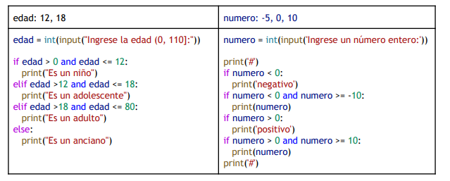

#  ESTRUCTURA SELECTIVA

## Casos de Estudio
Analice, diseñe y codifique los siguientes enunciados en Python
1. Una institución de educación, con regímenes tanto diurnos como vespertinos, considera lo siguiente en su
proceso académico: si un estudiante de régimen vespertino tiene una nota de presentación mayor o igual a 6,
se exime, y si no alcanza el 6 pero tiene una nota de presentación igual o mayor a 3.5, rinde examen. Si el
estudiante es de régimen diurno, si su nota de presentación es mayor o igual a 3.5, rinde examen (no hay
posibilidad de eximirse). En ambos regímenes, si la nota de presentación es menor que 3.5, reprueba. Hacer la
tabla de decisión y escriba el algoritmo correspondiente.
## Ejercicios
1. Si r = 10, s = 0, resolver mostrando el orden de los pasos la siguiente expresión lógica:
(r != 10) or not (s == -r) or not((True or r >= 10) and not (s <= 0 and True))
2. Dadas v, w, z variables de tipo numérico entero escribir las expresiones lógicas correspondientes a los
siguientes enunciados:
A. v es no positivo y w es no menor o igual a cero.
B.  v, w, z son diferentes entre sí.
C. v es no nulo y w no es mayor a z.
D. w está estrictamente entre v y z.
E. v es igual a w o z es no negativo pero no ambos a la vez.
3. Analice el siguiente código en Python:
1. clave = "iprog1"
2. contraseña = input("Introduce la contraseña: ")
3. if clave == contraseña:
4. print("La contraseña coincide")
5. else:
6. print("La contraseña NO coincide")

- ¿Cuándo se visualizará en la pantalla el mensaje “coincide”?
- Si ingresa en la variable contraseña iProg1, ¿Qué mensaje se verá en la pantalla?
- Mejore la sentencia en la línea 3 utilizando alguna función que salve la situación anterior.
- ¿Qué sucede si ingresa un número?

## Ejercicio 4

Escribir el código en python que permita el registro de la edad del cliente y la cantidad de fichas que compra en una sala de juegos para niños. El programa debe mostrar el monto total de las fichas compradas teniendo en cuenta que si la edad está en el intervalo `[4,7)` el precio de las fichas es un 20% más barata y además reciben 5 fichas gratis, si la edad está en el intervalo `[7,10)` el precio de las fichas es un 15% más cara. Para edades fuera de esos rangos no se permite el ingreso a la sala de juegos. El precio unitario de las fichas no varía y es de 35 pesos.

## Ejercicio 5

Diseñar un algoritmo que permita leer 3 números y escribir en la pantalla si están en “orden creciente” o “decreciente” o “no están en orden”.

## Ejercicio 6

Diseñar un algoritmo que ordene en forma creciente tres valores diferentes `a`, `b`, `c`

## Ejercicio 7

7. Sin ejecutar el código en la computadora, ingresando primero “a” y luego “v” debe mostrar todas las salidas en la pantalla.

`print("Este programa mezcla dos colores.")` 
`print(" r. Rojo a. Azul")` 
`primera = input(" Elija un color (r o a): ")` 
`if primera == "r": 
print(" a. Azul v. Verde")  
`segunda = input(" Elija otro color (a o v): ") 
if segunda == "a":  

print("La mezcla de Rojo y Azul producen Magenta.")
else:
print("La mezcla de Rojo y Verde producen Amarillo.")
else:
print(" v. Verde r. Rojo")
segunda = input(" Elija otro color (v o r): ")
if segunda == "v": 
print("La mezcla de Azul y Verde producen Cian.")
else:
print("La mezcla de Azul y Rojo producen Magenta.")
print("¡Hasta la próxima!")`

8. Sin ejecutar el código en la computadora, ¿Cuál es la salida por la pantalla? Para los siguientes valores:

9. Realizar un programa que permita averiguar si un año es bisiesto. Considera que para que un año sea bisiesto
debe ser divisible por 4 y no debe ser divisible por 100, excepto que también sea divisible por 400.
10. Diseñar dos programas que utilicen la sentencia selectiva simple y la sentencia encadenada if…elif…else…, el
programa debe pedir la edad y en función del valor recibido mostrará un mensaje diferente.

● si el valor de la edad es negativo, se trata de un error

● si el valor de la edad está entre 0 y 17, se trata de un menor de edad

● si el valor de la edad es superior o igual a 18, se trata de un mayor de edad

11. Hacer dos programas que utilicen la sentencia selectiva compuesta (anidada) y la sentencia if…elif…else…, el
programa debe pedir un número y mostrará:

● si es múltiplo de dos,

● si es múltiplo de cuatro (y de dos)

● si no es múltiplo de dos

Nota: El valor 0 se considerará múltiplo de 4 y de 2.

12. Un instituto de enseñanza de inglés necesita un programa que le permita, cada día, procesar observaciones
sobre las clases de ese día. El instituto dicta clases a estudiantes de distintos niveles y cada nivel tiene clases
en un día de la semana diferente: los lunes se dicta el Nivel Inicial, los martes el Nivel Intermedio, los
miércoles el Nivel Avanzado, los jueves son para Práctica Hablada y los viernes se dicta Inglés para Viajero El usuario ingresa la fecha actual en formato “día, DD/MM", donde [día] es un día de la semana
(lun-mar-mie-jue-vie), DD es el número de día y MM es el número de mes. Si el usuario ingresa un día de la
semana inexistente o una fecha cuyo día supere el rango 1-31 o el mes de 1 a 12, indique que se produjo un
error. Debe permitirse que ingrese el día de la semana en minúsculas o mayúsculas indistintamente.
Una vez indicada la fecha, el usuario necesita poder indicar si ese día se tomaron exámenes, pero eso sólo si se
trata de los niveles Inicial, Intermedio o Avanzado, ya que las Prácticas Habladas y el Inglés para Viajeros no
tienen exámenes. Si hubo exámenes, el usuario ingresará cuántos alumnos aprobaron y cuántos no, y el
programa le mostrará el porcentaje de Aprobados.
Si el día fue el correspondiente a práctica hablada, el usuario deberá ingresar el porcentaje de asistencia a
clase y el programa le indicará "asistió la mayoría" en caso de que la asistencia sea mayor al 50% o "no asistió la
mayoría" si no es así.
Si se trata del inglés para viajeros y la fecha actual corresponde al día 1 de cualquier mes, se deberá imprimir
"Comienzo de nuevo ciclo".

13. Hacer un programa para el siguiente enunciado: Una aerolínea tiene proyectada la siguiente promoción: las
personas que viajen a Europa o África y son pasajeros frecuentes, acceden a un descuento de un 17% en el
valor de su pasaje. Además, los que van a Europa sean o no frecuentes reciben un descuento adicional. Los
pasajeros que viajan a cualquier punto de Egipto y son de tipo frecuente, tienen derecho a la compra de un
pasaje al mismo destino por un 50% de su valor. Los pasajeros que viajan fuera de Egipto pero dentro de África,
y no son del tipo frecuente, se les concede una cantidad de kilómetros gratuitos en su siguiente viaje. Los que
son o no son frecuentes y viajan a Europa, tienen derecho a una noche gratuita en un hotel de la ciudad
destino, y tienen el mismo derecho los que van a países de África (no Egipto) y son frecuentes.

14. Hacer un programa para el siguiente enunciado: El proceso de inscripción de estudiantes de un instituto se
efectúa de la siguiente manera: si el estudiante es nuevo, debe llenar una ficha de inscripción con sus datos.
Además, debe pagar un derecho de incorporación, a menos que tenga algún tipo de beca autorizada. Todos los
estudiantes, antiguos y nuevos, deben cancelar un valor por concepto de matrícula antes de una cierta fecha
límite. Si el estudiante paga dentro de tal plazo, se inscribe en las asignaturas. Si lo hace fuera del plazo
establecido, deberá elevar una solicitud. Dependiendo de los motivos que el estudiante tuvo para pagar la
matrícula fuera del plazo, la solicitud podrá ser aprobada o rechazada. Si es rechazada, quedará fuera del
proceso y perderá los valores que hubiera cancelado. Si es aceptada, podrá efectuar su inscripción de
asignaturas, previo pago de una multa, de la cual están exentos los estudiantes nuevos.

